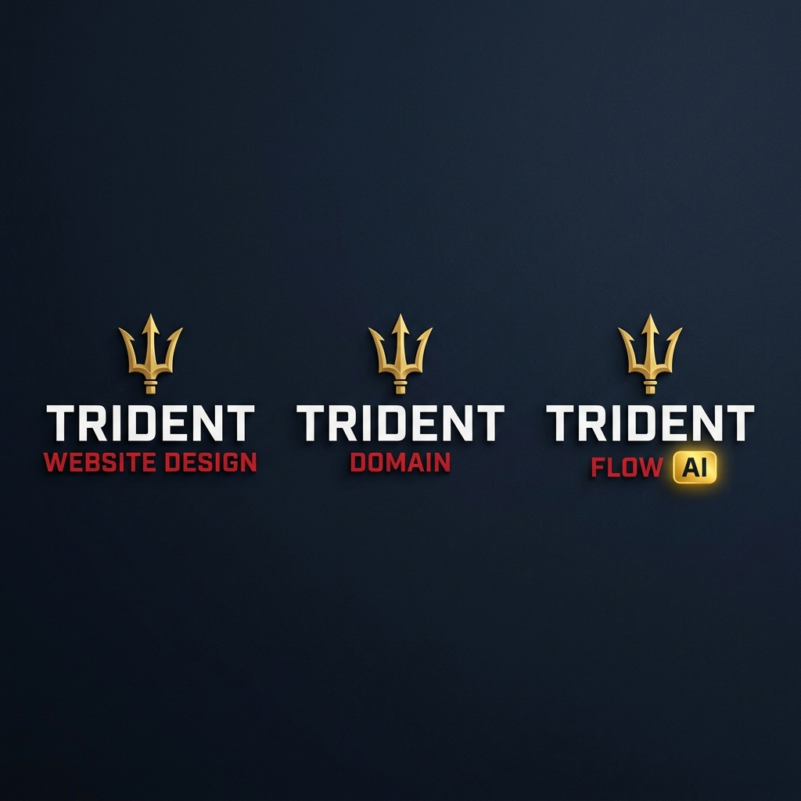
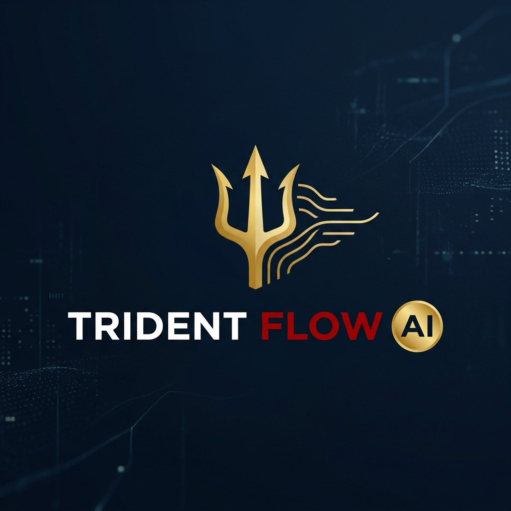

# 🔱 Official Trident Brand Ecosystem Specification

This document defines the official visual identity, color codes, and brand architecture across the Trident business ecosystem: **Trident Website Design**, **Trident Domain**, and **Trident Flow AI**.

---

## 🎨 Official Unified Brand Family

The official locked-in branding suite uses the standardized gold Trident emblem paired with USMC Scarlet accent typography on high-contrast midnight slate (`#0D1322`):

---

## 🖼️ Standalone Trident Flow AI Logo

### Logo Breakdown
* **The Icon**: A highly stylized, clean gold trident 🔱 that acts as the unifying emblem across all products.
* **TRIDENT**: Stretched, elegant sans-serif lettering in crisp white for structural stability and high corporate authority.
* **FLOW**: Styled in vibrant **Marine Corps Scarlet red** (`#D01C1C`) to define speed and automation.
* **AI**: Highlighted in a gold-framed chip or badge element (`#F5BA23`) to stand out as a modern intelligence layer.

---

## 🎨 Color Palette Specifications (USMC Standards)

To maintain a professional, high-converting look across all platforms, use these exact color codes based on USMC standards:

| Element | Color Name | Hex Code | Visual Application |
| :--- | :--- | :--- | :--- |
| **Primary Accent** | **USMC Scarlet** | `#D01C1C` | Active states, main logo brand text ("FLOW", "DOMAIN", "WEBSITE DESIGN"), key keywords |
| **Secondary Accent** | **USMC Gold** | `#F5BA23` | Trident icon 🔱, primary call-to-actions, "AI" badges, gold button hovering |
| **Background Dark** | **Midnight Slate / Navy** | `#0D1322` | Dashboard/website background, premium high-contrast feel |
| **Background Cards** | **Navy Pearl** | `#161F30` | Panel background cards, input borders, structural separators |
| **Typography** | **Off-White / Crisp White** | `#F8F9FA` | Body text, readable heading elements (`TRIDENT`) |

---

## 🎯 Brand Breakdown & Architecture

| Brand | Target & Purpose | Typography & Accent |
| :--- | :--- | :--- |
| **TRIDENT WEBSITE DESIGN** | High-performance custom web design agency | Gold Emblem + Crisp White `TRIDENT` + USMC Scarlet `WEBSITE DESIGN` |
| **TRIDENT DOMAIN** | Premium domain portfolio & marketplace | Gold Emblem + Crisp White `TRIDENT` + USMC Scarlet `DOMAIN` |
| **TRIDENT FLOW AI** | SaaS biz-in-a-box for digital creators | Gold Emblem + Crisp White `TRIDENT` + USMC Scarlet `FLOW` + Glowing Gold `AI` Badge |

---

## ⚙️ Active Dashboard Configuration

* **SaaS Domain**: [tridentflowai.com](https://tridentflowai.com)
* **Dashboard Branding**: Configured in [admin.html](admin.html) with `Trident Flow AI™`.
